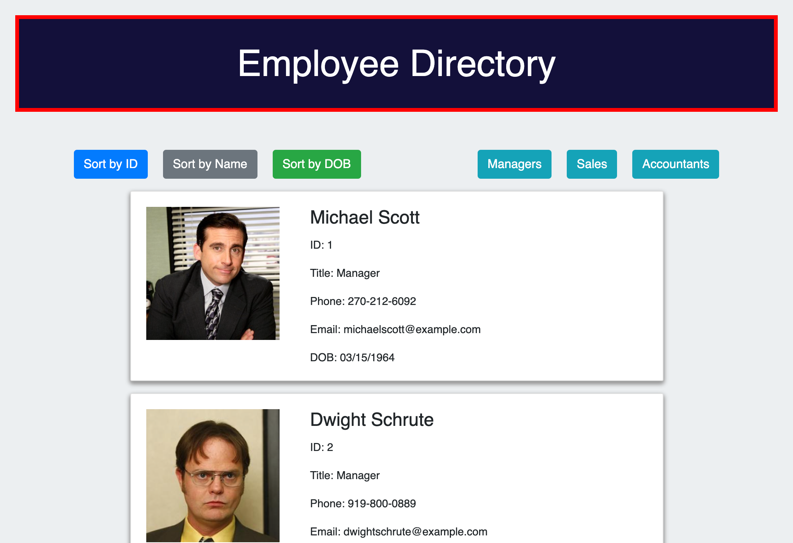

# Homework 19: Employee Directory (React)

## Description
This website application allows a user to view a list of employees. The website updates a new employee automatically when added to the employee.json file. Directory can be sorted by ID, name, or Date of birth. It can also be filtered for various position titles.

## Deployed Application (GitHub Pages)
<a href="https://kdoh52.github.io/hw-19/" target="_blank">Employee Directory</a>

## Credits
* HTML
* CSS
* Javascript
* Node.js
* Bootstrap
* React
* React-dom
* GitHub pages

## Portfolio
<a href="https://kdoh52.github.io/" target="_blank">Updated portfolio</a>

## Contact
* kdoh52@gmail.com
